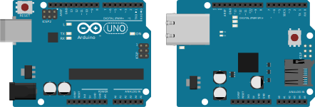
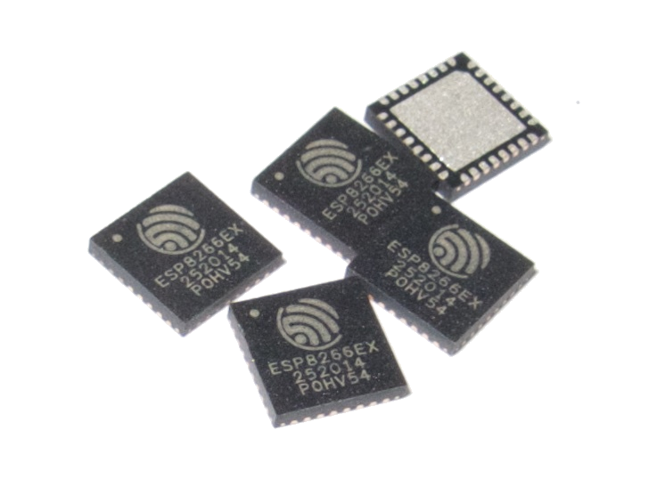
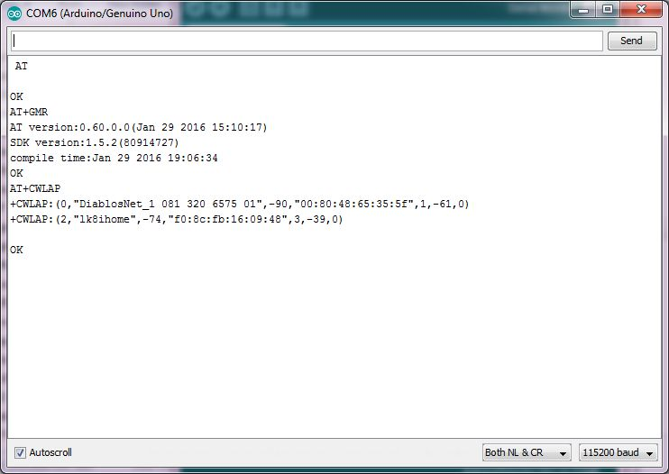
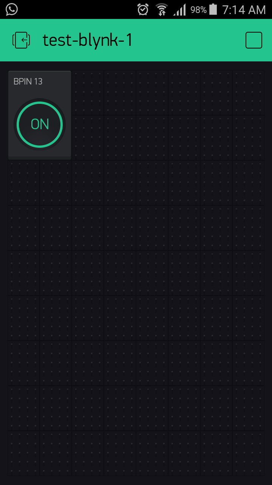

class: split-30 nopadding
background-image: url( https://cloud.githubusercontent.com/assets/4231611/13386787/e0ce395a-dee2-11e5-956d-5e82dea71d0b.jpg )

.column_t2.center[.vmiddle[
.fgtransparent[
.figplaint[

]
]
]]
.column_t2[.vmiddle.nopadding[
.shadelightdark[.boxtitle1[
### LTKA Labs
# ESP8266 Basics

### [Eueung Mulyana](https://github.com/eueung)
### http://eueung.github.io/ET3010/esp8266
#### ET-3010 | [Attribution-ShareAlike CC BY-SA](https://creativecommons.org/licenses/by-sa/4.0/)
#### 
]]
]]

---
class: column_t1 middle

.fonth4[
.tab1.fullwidth[
| Outline  |
|:-------------:|
| Short Intro |
| ESP-01 |
| Blynk |
]]

---
class: split-30 nopadding
background-image: url( https://cloud.githubusercontent.com/assets/4231611/13386787/e0ce395a-dee2-11e5-956d-5e82dea71d0b.jpg )

.column_t2.center[.vmiddle[
.fgtransparent[
.figplaint[

]
]
]]
.column_t2[.vmiddle.nopadding[
.shadelightdark[.boxtitle1[
### 
# Short Intro

### 
### 
#### 
#### 
]]
]]

---
class: column_t2 center middle

# Previously ...
####&nbsp;

.figplaint[

]
To Get Network Access: UNO + Ethernet Shield

---
class: column_t1 center middle

# Sometimes... network wires &amp; switch ports are not available ..
<br/>
### In some conditions, they are .bluelight[**not**] an option at all!  

---
class: split-30 nopadding 
background-image: url(images/fig01.jpg)

.column_wt[.vmiddle.pushfront[

### Enter
#ESP8266

.fonth5[Small]
<br/>
.fonth5[Powerful]
<br/>
.fonth5[Cheap]
]]
.column_t2[.vmiddle[
]]

---
background-image: url(images/fig02.jpg)

---
class: split-60 nopadding 
background-image: url(images/fig06.jpg)

.column_t2[.vmiddle[
]]
.column_t1t[.vmiddle.pushfront[

#Arduino and WiFi

<br/>
.fonth5[
Official Arduino WiFi Shield]
EUR **69** + VAT <br/><br/>
.fonth5[
Sparkfun CC3000 Shield] 
USD **40**<br/><br/>
.fonth5[
Adafruit CC3000 Module]
USD **35**

]]

---
class: split-50 nopadding 

.column_t1[.vmiddle[


# ESP8266
- Developed by Espressif System
- Low Cost
- Part Number is ESP8266EX
- 20+ M Chip Sold
- 5000 Active Developers

.figplaint[

]


]]
.column_t2[.vmiddle[

.fonth5[.red[**3.3**]V  - .blue[**215**]mA (measurement: peak ~.red[**430**] mA)]<br/><br/>
.fonth5[CPU: 32-bit, 80MHz (or 160 MHz), Tensilica Xtensa Core]<br/><br/>

- Wi-Fi 802.11b/g/n (Station or AP), WEP/WPA/WPA2
- Timers, Deep Sleep Mode
- I/CRAM 32-64KB, DRAM 80-96KB
- External QPI Flash (200KB SDK, prev. 512 KB / 4Mbit, new min. 1 MB/8Mbit)
- GPIO (2-16)
- SPI, I2C, I2S, UART
- 10-Bit ADC


]]

---
class: split-30 nopadding 
background-image: url(images/fig05.jpg)

.column_t1t[.vmiddle.pushfront[
### ESP8266 Series
#ESP-xx

]]
.column_t2[.vmiddle[
]]

---
class: split-70 nopadding 
background-image: url(images/fig001.jpg)

.column_t2[.vmiddle[
]]
.column_t1t[.vmiddle.pushfront[
### Pinout
#ESP-01
]]

---
class: split-30 nopadding 
background-image: url(images/fig002.jpg)

.column_t1t[.vmiddle.pushfront[
### Pinout
#ESP-12
]]
.column_t2[.vmiddle[
]]

---
class: split-70 nopadding 
background-image: url(images/fig03.jpg)

.column_t2[.vmiddle[
]]
.column_t1t[.vmiddle.pushfront[
### ESP-01
### ESP-12F + Breakout
<br/><br/><br/>
IDR **50**k &amp; IDR **90**k
]]

---
class: split-70 nopadding 
background-image: url(images/fig04.jpg)

.column_t2[.vmiddle[
]]
.column_wt[.vmiddle.pushfront[
.fonth5[**Three Alternatives..**]
]]

---
class: split-70 nopadding 
background-image: url(images/fig07.jpg)

.column_t2[.vmiddle[
]]
.column_t1t[.vmiddle.pushfront[
###Actually More ...
# Dev Boards

- Adafruit Huzzah
- Sparkfun MOD-WIFI-ESP8266-DEV
- NodeMCU v1

Around USD **10** or less
]]

---
background-image: url(images/fig08.jpg)

---
background-image: url(images/fig09.jpg)

---
class: split-30 nopadding
background-image: url( https://cloud.githubusercontent.com/assets/4231611/13386787/e0ce395a-dee2-11e5-956d-5e82dea71d0b.jpg )

.column_t2.center[.vmiddle[
.fgtransparent[
.figplaint[

]
]
]]
.column_t2[.vmiddle.nopadding[
.shadelightdark[.boxtitle1[
### 
# ESP-01

### 
### 
#### 
#### 
]]
]]

---
class: split-60 nopadding 
background-image: url(images/fig003.jpg)

.column_t2[.vmiddle[
]]
.column_t1t[.vmiddle.pushfront[
# ESP-01
- 2x4 DIL Header
- Integrated Antenna
- Integrated LED (VCC, TXD)
- 1MB/8Mbit Flash (2015, Black) 

### Operating
- VCC: 3.3V (av. active 200mA, peak see prev.)
- IO &amp; UART are not 5V Tolerant
- CH_PD must be Pulled High
]]

---
class: split-30 nopadding 
background-image: url(images/fig-tuan1.jpg)

.column_wt[.vmiddle.pushfront[
#Wiring Example
### Normal Operation
]]
.column_t2[.vmiddle[
]]

---
class: split-30 nopadding 
background-image: url(images/fig-tuan2.jpg)

.column_wt[.vmiddle.pushfront[
#Wiring Example
### Flash / Program
]]
.column_t2[.vmiddle[
]]

---
class: split-30 nopadding 
background-image: url(images/aac.jpg)

.column_t1t[.vmiddle.pushfront[
#Wiring Example
### Pullup Resistors
]]
.column_t2[.vmiddle[
]]

---
class: split-30 nopadding 
background-image: url(images/esp8266-simple.jpg)

.column_t1t[.vmiddle.pushfront[
#Wiring Example
### Decoupling Capacitors
]]
.column_t2[.vmiddle[
]]

---
class: split-30 nopadding 
background-image: url(images/i-01.jpg)

.column_wt[.vmiddle.pushfront[
#Wiring Example
### Bypass Capacitors
]]
.column_t2[.vmiddle[
]]

---
class: column_t1 center middle

# Let's Start ...

---
background-image: url(images/p04.jpg)

---
background-image: url(images/p05.jpg)

---
background-image: url(images/p06.jpg)

---
class: column_t1 center middle

# 
####&nbsp;

.figstyle1[

]
Serial Monitor: **AT** | **AT+GMR** | **AT+CWLAP**


---
class: split-30 nopadding
background-image: url( https://cloud.githubusercontent.com/assets/4231611/13386787/e0ce395a-dee2-11e5-956d-5e82dea71d0b.jpg )

.column_t2.center[.vmiddle[
.fgtransparent[
.figplaint[

]
]
]]
.column_t2[.vmiddle.nopadding[
.shadelightdark[.boxtitle1[
### 
# Blynk

### 
### 
#### 
#### 
]]
]]

---
class: split-50 nopadding 
background-image: url(images/blynk.jpg)

.column_t2[.vmiddle[
]]
.column_wt[.vmiddle.pushfront[
.fonth5[
Blynk is a Platform with iOS and Android apps to control Arduino, Raspberry Pi and the likes over the Internet.

It's a digital dashboard where you can build a graphic interface for your project by simply dragging and dropping widgets.

Blynk  is not tied to some specific board or shield. Instead, it's supporting hardware of your choice. Whether your Arduino or Raspberry Pi  is linked to the Internet over Wi-Fi, Ethernet or this new ESP8266 chip, Blynk will get you online and ready for the Internet Of Your Things. 
]
]]

---
class: split-30 nopadding 
background-image: url(images/blynk-01.jpg)

.column_wt[.vmiddle.pushfront[
### Download App
### Create Account
]]
.column_t2[.vmiddle[
]]

---
class: split-30 nopadding 
background-image: url(images/blynk-02.jpg)

.column_wt[.vmiddle.pushfront[
### Create New Project
.fonth5[Remember / Email Auth Token]
]]
.column_t2[.vmiddle[
]]

---
class: split-30 nopadding 
background-image: url(images/blynk-03.jpg)

.column_wt[.vmiddle.pushfront[
### Add (Widget Box)
### Select Button
]]
.column_t2[.vmiddle[
]]

---
class: split-30 nopadding 
background-image: url(images/blynk-04.jpg)

.column_wt[.vmiddle.pushfront[
.fonth5[
- Edit Title
- Select Output Pin (D13)
- Mode (Switch)
]
]]
.column_t2[.vmiddle[
]]

---
class: split-30 nopadding 
background-image: url(images/p03.jpg)

.column_wt[.vmiddle.pushfront[
.fonth5[
Switch TX - RX Wire <br/><br/>
Remove RST - GND Wire <br/><br/>
LED on Pin 13 (Better with Current Limiting Resistor)
]
]]
.column_t2[.vmiddle[
]]

---
background-image: url(images/p01.jpg)

---
class: column_t1

.overlay.pos-bl-1[
<svg class="size512 shadowwhite" viewBox="0 0 1024 1024">
  <use xlink:href="images/minions.svg#minion1"></use>
</svg>
]

.overlay.pos-tr-1[.overlayc.top_60.size_300_200.xkcd_font.center.black[

Download [Blynk Library](https://github.com/blynkkk/blynk-library/releases)<br/> Then Install : <br/><br/> .red[Blynk]<br/> .red[BlynkESP8266_HardSer]

]
<svg class="size800 fillwhite" viewBox="0 0 1024 1024">
  <use xlink:href="images/bubbles.svg#bubble1"></use>
</svg>
]

---
class: split-50 nopadding 

.column_t1[.vmiddle.right[

# Write Some Codes

.fonth5[
<br/>
Then Upload<br/><br/>
Don't forget to temporarily release the RX pin!
]


]]
.column_t2[.vmiddle[

```c
#define BLYNK_PRINT Serial  

*#include <ESP8266_HardSer.h>
*#include <BlynkSimpleShieldEsp8266_HardSer.h>

#define EspSerial Serial
ESP8266 wifi(EspSerial);

char auth[] = "701f5e2263494783bb7ee9a36fc12345";

*void setup()
{
  Serial.begin(115200);  
  delay(10);

  EspSerial.begin(115200);  
  delay(10);

  Blynk.begin(auth, wifi, "lk8fm", "0123456789");
}

*void loop()
{
  Blynk.run();
}
```


]]

---
class: split-60 nopadding 

.column_t1[.vmiddle.right[

# Blynk App

.fonth5[
<br/>
Go to Dashboard<br/>
Play<br/>
Push the Button
]


]]
.column_t2[.vmiddle[


.figplaint[

]


]]

---
background-image: url(images/p02.jpg)


---
class: split-30 nopadding
background-image: url( https://cloud.githubusercontent.com/assets/4231611/13386787/e0ce395a-dee2-11e5-956d-5e82dea71d0b.jpg )

.column_t2.center[.vmiddle[
.fgtransparent[
.figplaint[

]
]
]]
.column_t2[.vmiddle.nopadding[
.shadelightdark[.boxtitle1[
### 
# Refs

### 
### 
#### 
#### 
]]
]]

---
# Refs
.fonth5[
1. Zhu Baoshi - Build WiFi Gadgets Using ESP8266, GeekCamp.SG 2015
1. Tom Tobback, Cassiopeia - ESP8266+Arduino, ESP8266+Arduino workshop 2015 
1. Burak Aydin - Hack The ESP8266
1. Pighixxx - [Boards - Pinout](http://www.pighixxx.com/test/pinoutspg/boards/)
1. Tuanpmt/Espduino - [ESP8266 Network Client for Arduino](https://github.com/tuanpmt/espduino)
1. Internet of Home Things - [4 Ways to Eliminate ESP8266 Resets](http://internetofhomethings.com/homethings/?p=396)
1. [Update the Firmware in Your ESP8266 Wi-Fi Module](http://www.allaboutcircuits.com/projects/update-the-firmware-in-your-esp8266-wi-fi-module/)
1. ESP8266 Support WIKI - [Getting-Started-with-the-ESP8266](http://www.esp8266.com/wiki/doku.php?id=getting-started-with-the-esp8266)
1. sleemanj/ESP8266_Simple - [A simple Arduino library to perform HTTP operations on the ESP8266 Wifi Device](https://github.com/sleemanj/ESP8266_Simple)
1. [DIY ESP8266 ESP-01 Programing / Test board](http://www.nfriedly.com/techblog/2015/07/build-a-diy-esp8266ex-esp-01-dev-test-programming-board/)
1. [Blynk](http://www.blynk.cc/)
]

---
class: split-30 nopadding
background-image: url( https://cloud.githubusercontent.com/assets/4231611/13386787/e0ce395a-dee2-11e5-956d-5e82dea71d0b.jpg )

.column_t2.center[.vmiddle[
.fgtransparent[
.figplaint[

]
]
]]
.column_t2[.vmiddle.nopadding[
.shadelightdark[.boxtitle1[
### 
# END

### [Eueung Mulyana](https://github.com/eueung)
### http://eueung.github.io/ET3010/esp8266
#### ET-3010 | [Attribution-ShareAlike CC BY-SA](https://creativecommons.org/licenses/by-sa/4.0/)
#### 
]]
]]


